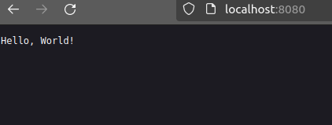

# Go dev курс
Боборыкина Маргарита ИА-131
#### Результаты выполенения программ

Простой калькулятор на языке Go (папка calculator)

  
  

Поиск наибольшего k-го элемента в массиве (папка slays_arrays)

  

Использование сторонних модулей (папка calculationmodule)

  

  

  

Тестирование и линтинг в Go (папка testing)

  
  
  

Знакомство с docker и docker compose (папка docker)

Контейнер с фронтендом
  

Контейнер с бэкендом
  
  

Результат запуска проекта при помощи docker-compose (фронтенд)

Результат запуска проекта при помощи docker-compose (бэкенд)

