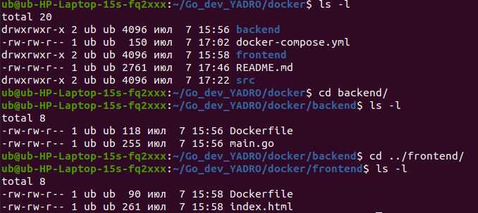

# Знакомство с docker и docker compose 
Цель: Опыт развертывания проектов с применением инструментов docker и docker compose

## Задание: 
В данной работе предстоит выполнить следующие задачи:

1. Установить docker локально
  
2. Найти пример проекта (или использовать собственный), содержащий REST API бэкенд часть и фронтенд часть (по желанию можно добавить базу данных) и создать из них docker образы. Сложность проекта не принципиальна, можно выбрать бэкенд часть с одним эндпоинтом, возвращающим текст “hello world”, и фронтенд часть, отображающим его.

3. Создать контейнеры из полученных образов и убедится в работоспособности проекта.

4. Достичь того же результата с применением docker compose.

## Ход выполнения:

- Установка docker & docker-compose
```
sudo apt update

sudo apt install apt-transport-https ca-certificates curl software-properties-common

curl -fsSL https://download.docker.com/linux/ubuntu/gpg | sudo apt-key add -

sudo add-apt-repository "deb [arch=amd64] https://download.docker.com/linux/ubuntu focal stable"

apt-cache policy docker-ce

```

```Output of apt-cache policy docker-ce

docker-ce:
  Installed: (none)
  Candidate: 5:19.03.9~3-0~ubuntu-focal
  Version table:
     5:19.03.9~3-0~ubuntu-focal 500
        500 https://download.docker.com/linux/ubuntu focal/stable amd64 Packages

```

```

sudo apt install docker-ce

sudo systemctl status docker

```

```Output
● docker.service - Docker Application Container Engine
     Loaded: loaded (/lib/systemd/system/docker.service; enabled; vendor preset: enabled)
     Active: active (running) since Tue 2020-05-19 17:00:41 UTC; 17s ago
TriggeredBy: ● docker.socket
       Docs: https://docs.docker.com
   Main PID: 24321 (dockerd)
      Tasks: 8
     Memory: 46.4M
     CGroup: /system.slice/docker.service
             └─24321 /usr/bin/dockerd -H fd:// --containerd=/run/containerd/containerd.sock

```

Запуск docker без команды sudo (опционально):
```
sudo usermod -aG docker ${USER}

su - ${USER}

groups
```

```Output
sammy sudo docker
```

```
sudo usermod -aG docker username  # вписать пользователя

```

Установка docker-compose:
```
sudo apt  install docker-compose
```
- Полученная структура проекта



- Сборка проекта

Сборка docker образов:
```
cd backend
docker build -t my-backend .

cd ../frontend
docker build -t my-frontend .

```
Создание и запуск контейнеров:
```
docker run -d -p 8080:8080 --name backend my-backend
docker run -d -p 80:80 --name frontend my-frontend

```

Проверка работоспособности:

http://localhost:8080 для проверки бэкенда
http://localhost для проверки фронтенда

- Создаем docker-compose.yaml

```
version: '3'
services:
  backend:
    image: my-backend
    ports:
      - "8080:8080"
  frontend:
    image: my-frontend
    ports:
      - "80:80"

```
Запуск:
```
docker-compose up
```

Проверка работоспособности:

http://localhost:8080 для проверки бэкенда
http://localhost для проверки фронтенда

- Опционально

Вывести список запущенных контенейров:
```
docker ps
```

Остановка контейнеров по id:
```
docker stop <container_id>
```

Перезапуск docker:
```
sudo systemctl restart docker
```

Вывести список запущенных контенейров:
```
docker-compose ps
```
Перезапуск контенеров:
```
docker-compose down
docker-compose up --build
```


## Результат выполнения программы:

Контейнер с фронтендом:
  

Контейнер с бэкендом:
  
  

Результат запуска проекта при помощи docker-compose (фронтенд):


Результат запуска проекта при помощи docker-compose (бэкенд):


