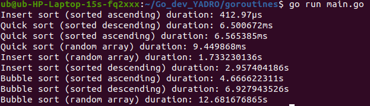

# Многопоточное программирование
Цель: Применить на практике полученные знания многопоточного программирования в языке Go. Использовать примитивы синхронизации доступа к общим разделяемым ресурсам.

## Задание:
В данной работе предстоит выполнить следующие задачи:

1. Реализовать структуру с использованием примитивов синхронизации Go.
2. Продемонстрировать работу созданной структуры с использованием выбранного примитива синхронизации.
3. Продемонстрировать работу программы без использования примитива синхронизации. Предполагается, что программа может работать только с его использованием. Например: написать структуру счетчика людей, проходящих через турникет в метро. В программе должна использоваться многопоточность.

## Выполнение задания
Написана программа, измеряющая скорость работы алгоритмов сортировки InserSort, QuickSort и BubbleSort.
Скорость проверяется для трех случаев:
- Массив изначально отсортирован от меньшего к большему
- Массив изначально отсортирован от большего к меньшему
- Случайный массив

## Результат выполнения программы:

